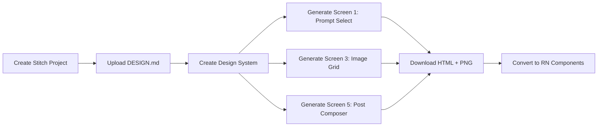

# AI Content Pipeline — Implementation Plan

**Problem Statement 4: Conversational Video & Motion with Omni Flash**  
**Stack:** Expo (managed) · React Native · NativeWind · TypeScript strict  
**Time budget: 5 hours | Stitch used for 3 of 5 screens**

---

## Decisions (Locked In)

| Decision | Choice | Reason |
|----------|--------|--------|
| **Framework** | Expo managed workflow + Expo Router | No native module headaches unless Gemma on-device blocks it (Risk #1) |
| **Styling** | NativeWind (Tailwind syntax on RN) | NOT web Tailwind, no CSS files — vibe-spec is explicit |
| **State** | React `useState` + Context only | No Zustand/Redux — not worth setup under 5h |
| **Networking** | Plain `fetch` | No axios |
| **Animation** | `react-native-reanimated` | Card transitions, shimmer loaders, video scrub |
| **Icons** | `lucide-react-native` | |
| **Social posting** | Mocked — local state + fake success toast | Decided. No real OAuth ever. |
| **Stitch usage** | Screens 1, 3, 5 (visual-heavy, low interactivity) | Screens 2 & 4 built directly (animation-heavy, API-coupled) |
| **Gemma fallback** | If on-device blocked in first 15 min → call Gemma via API | Don't spend > 15 min debugging native modules |
| **Stitch conversion cap** | 15 min per screen → fall back to hand-built from vibe-spec tokens | HTML→RN has no fixed cost; needs the same escape hatch as Gemma |

---

## Stitch Usage Strategy

> [!IMPORTANT]
> Stitch is used for **3 screens only** — the ones that are layout-heavy and benefit from high-fidelity generation without complex interactive state:
> - **Screen 1:** Prompt & Template Select
> - **Screen 3:** Image Grid & Select
> - **Screen 5:** Post Composer (mocked)
>
> **Screens 2 and 4 are built directly in React Native** because they are animation-driven (Reanimated shimmer, video scrub controls) — Stitch HTML-to-RN conversion would cost more time than building directly from the vibe spec.
>
> **HTML→RN conversion fallback (applies to every Stitch screen):** Stitch outputs web HTML/CSS, not RN code — translating flex layouts and CSS patterns into NativeWind by hand has no fixed cost, it could take 5 minutes or 25. Cap each screen's conversion at **15 minutes**. If a screen isn't converting cleanly by then, stop and hand-build it directly from the vibe-spec design tokens instead of fighting the conversion — same escape-hatch pattern as the Gemma on-device fallback.

---

## Architecture Summary

```
Screen 1: Prompt & Template Select
  → Screen 2: Supervisor (Gemma decomposing, transient ~2s)
    → Screen 3: Image Grid & Select (NB2 Lite parallel results)
      → Screen 4: Video Studio (Omni Flash + conversational edit)
        → Screen 5: Post Composer (mocked) → success → back to Screen 1
```

**API chain (the actual rubric):** NB2 Lite (`gemini-3.1-flash-lite-image`) → Omni Flash (`gemini-omni-flash-preview`)

---

## Proposed Changes

### Phase 1 — Scaffold + Triple Spike: API + Stitch + On-Device Gemma (Hour 0–0:30)

> [!IMPORTANT]
> **Do all three spikes before building any UI, in parallel where possible.** This phase exists to surface every hard failure while you still have 4:30 left to route around it — not to produce polished output.
>
> 1. **API spike:** one raw `fetch` to NB2 Lite, one to Omni Flash. Both must return 200.
> 2. **Stitch MCP spike:** confirm the Stitch tools are actually reachable — `list_tools` returns the Stitch prefix, auth works, `create_project` succeeds on a throwaway project. If this fails, you need to know before Phase 2 builds a design system on top of it.
> 3. **On-device Gemma spike:** attempt MediaPipe LLM Inference / Google AI Edge in Expo managed workflow, **first 15 minutes, not later.** If native modules are blocked, switch to calling Gemma via API immediately and move on — don't debug past the 15-minute mark. This is the single highest-risk item in the whole plan; it does not get scheduled later than Phase 1 under any circumstance.

#### [NEW] Expo App Scaffold

```bash
npx create-expo-app@latest ./ --template blank-typescript
npx expo install nativewind react-native-reanimated lucide-react-native
```

File structure:
```
app/
├── _layout.tsx           # Root layout, Expo Router
├── index.tsx             # Screen 1: Prompt & Template Select
├── supervisor.tsx        # Screen 2: Gemma Supervisor (built directly)
├── image-grid.tsx        # Screen 3: Image Grid & Select
├── video-studio.tsx      # Screen 4: Video Studio (built directly)
└── post-composer.tsx     # Screen 5: Post Composer
components/
├── TemplateChip.tsx      # Reusable chip: Cinematic / Product / Minimalist / Vibrant
├── ImageCard.tsx         # Grid card with shimmer + checkmark select state
├── VideoPlayer.tsx       # Video preview with scrub controls
└── SkeletonShimmer.tsx   # Reanimated shimmer loader
lib/
├── gemma.ts              # Gemma supervisor: prompt → sub-task array
├── nb2.ts                # NB2 Lite image generation
└── omniFlash.ts          # Omni Flash video generation + conversational edit
types/
└── index.ts              # Shared types
tailwind.config.js        # NativeWind config with Studio Noir tokens
```

#### [NEW] `tailwind.config.js` — Studio Noir tokens

| Token | Value | Usage |
|-------|-------|-------|
| `bg-noir` | `#0B0B0F` | Screen background |
| `bg-surface` | `#17171D` | Cards, panels |
| `accent-violet` | `#7C5CFF` | CTAs, active states, Gemma indicator |
| `accent-mint` | `#3DDC97` | Success states only |
| `text-primary` | `#F5F5F7` | Headings, body |
| `text-muted` | `#8A8A94` | Captions, meta |
| `error` | `#FF5C5C` | Errors |

Typography: Space Grotesk (headings) + Inter (body). 4-size scale only: 28 / 18 / 15 / 13.

#### [NEW] `types/index.ts`

```typescript
type TemplateId = 'cinematic' | 'product' | 'minimalist' | 'vibrant';

interface SubTask {
  id: string;
  prompt: string;
  template: TemplateId;
}

interface GeneratedImage {
  id: string;
  url: string;          // base64 or blob URL
  subTask: SubTask;
  selected: boolean;
}

interface VideoResult {
  id: string;
  sourceImageId: string;
  url: string;
  caption: string;
  conversationHistory: { role: 'user' | 'model'; content: string }[];
}
```

#### [NEW] API Spike (verify before any UI work)

```typescript
// lib/nb2.ts — spike call
const res = await fetch('https://generativelanguage.googleapis.com/v1beta/models/gemini-3.1-flash-lite-image:generateContent', {
  method: 'POST',
  headers: { 'Content-Type': 'application/json', 'x-goog-api-key': API_KEY },
  body: JSON.stringify({ contents: [{ parts: [{ text: 'a cinematic sunset photo' }] }] })
});
```

```typescript
// lib/omniFlash.ts — spike call
const res = await fetch('https://generativelanguage.googleapis.com/v1beta/models/gemini-omni-flash-preview:generateContent', ...);
```

**Gate: both return 200 before proceeding.**

---

### Phase 2 — Stitch Design System + Screen 1 Generation (Hour 0:30–1:00)

#### [NEW] `.stitch/DESIGN.md` — Studio Noir Design System

Generated using `taste-design` + `design-md` skills. Key directives from vibe-spec:

```markdown
# Design System: AI Content Pipeline

## 1. Visual Theme & Atmosphere
Dark, high-contrast creative-studio UI in the style of Figma dark mode or CapCut.
Signals "serious generation tool" not "toy". Near-black background with slight blue 
undertone. Flat surfaces, no gradients except one subtle radial glow on AI-thinking state.
Density: 6 (balanced), Variance: 3 (restrained), Motion: 4 (fast, snappy, not bouncy).

## 2. Color Palette & Roles
- **Void Black** (#0B0B0F) — Screen background (slight blue undertone, not pure black)
- **Studio Surface** (#17171D) — Cards, panels, all elevated surfaces
- **Electric Violet** (#7C5CFF) — CTAs, active states, Gemma-thinking indicator
- **Mint Success** (#3DDC97) — ONLY for success states ("Posted!", generation complete)
- **Ghost White** (#F5F5F7) — Primary text
- **Ash Muted** (#8A8A94) — Captions, metadata, secondary text
- **Alarm Red** (#FF5C5C) — Error and warning states

## 3. Typography Rules
- Display (28px): Space Grotesk — Screen titles
- Section headers (18px): Space Grotesk — Panel and section labels
- Body (15px): Inter — All UI body text
- Caption/meta (13px): Inter — Timestamps, platform labels, metadata
- STRICT: 4 sizes only. No intermediate sizes.

## 4. Component Stylings
- Cards: 16px corner radius, Studio Surface fill (#17171D), no shadows — flat
- Buttons/chips: 12px corner radius, flat violet fill for primary, surface fill for secondary
- Template chips: pill-shaped with 12px radius, selected = violet fill, unselected = surface outline
- Checkmarks on image cards: violet circle, white check, top-right corner
- Skeleton shimmer: Studio Surface base with lighter (#252530) animated highlight

## 5. Layout Principles
- Generous gutters on image grid: 12-16px between cards
- UI chrome recedes — images/video are the hero content
- No gradients EXCEPT one radial violet glow (low opacity ~0.15) on the Supervisor screen

## 6. Motion & Interaction
- Transitions: 150-200ms, ease-out — fast and snappy
- No bounce or spring physics — reinforces "professional tool"
- Shimmer loaders via react-native-reanimated (not spinners)
- Card selection: immediate scale tap feedback (scale 0.97 on press)

## 7. Anti-Patterns (Banned)
- No pure black (#000000) — use #0B0B0F
- No gradients except the one violet glow
- No spinners — skeleton shimmer only
- No bouncy spring animations
- No bright consumer-app aesthetics
- No more than 4 typography sizes
- No rounded-full elements except template chips
```

#### Stitch MCP Workflow

1. `list_tools` → find Stitch prefix
2. `create_project` → title: "AI Content Pipeline", deviceType: MOBILE, dark mode
3. Upload DESIGN.md → `upload_design_md`
4. `create_design_system_from_design_md` → save to `.stitch/metadata.json`
5. `generate_screen_from_text` → **Screen 1: Prompt & Template Select**
6. Download HTML + screenshot to `.stitch/designs/screen1-prompt.html` / `.png`

**Screen 1 Enhanced Prompt:**
> A dark creative-studio mobile app screen for AI content generation. The screen is the starting point where a user types their creative intent and selects visual style templates.
>
> **PLATFORM:** Mobile, iOS/Android
>
> **PAGE STRUCTURE:**
> 1. **Header:** "Create Content" title in 28px bold, left-aligned. Small avatar/profile circle top-right.
> 2. **Input Section:** "Describe your idea..." text area on studio-surface card, generous padding, 16px corner radius. Violet focus ring when active.
> 3. **Template Chips Row:** Horizontal scrollable row of 4 style chips — "Cinematic", "Product", "Minimalist", "Vibrant". Pills with 12px radius. Selected = violet fill, unselected = surface fill with muted border. Multiple can be selected.
> 4. **Generate Button:** Full-width primary CTA "Generate Content" at bottom. Violet fill, 12px radius. Disabled state when no templates selected.
> 5. **Recent label:** Small "Recent Generations" section header below chips (18px, muted) — collapsed state, chevron to expand.

---

### Phase 3 — Screen 2 (Supervisor, Direct Build) + Gemma Decomposition Logic (Hour 1:00–1:30)

By this point the Gemma on-device-vs-API decision was already made in Phase 1 — this phase just wires up whichever path won.

**Screen 2 is built directly** — it's a transient animation screen, not worth Stitch conversion.

#### [NEW] `app/supervisor.tsx` — Gemma Supervisor Screen

Built directly in React Native with Reanimated:

- Near-black background with **one radial violet glow** (the only gradient in the app — `react-native-linear-gradient` or SVG overlay, low opacity 0.15)
- Animated status list: shows decomposed sub-tasks appearing one by one with stagger (150ms intervals)
- Violet pulsing dot indicator: "Gemma is thinking..."
- Sub-task chips appear as Gemma emits them: `"Generating cinematic variant..."`, `"Generating product variant..."`
- Auto-advances to Screen 3 when all sub-tasks dispatched (no user action needed — transient ~2s)
- Do NOT add a skip button — this screen is the differentiator pitch moment for judges

#### [NEW] `lib/gemma.ts` — Supervisor Logic

```typescript
async function decomposeIntent(userPrompt: string, selectedTemplates: TemplateId[]): Promise<SubTask[]> {
  // Call Gemma (on-device via MediaPipe if available, else via API)
  // Prompt: "Decompose this creative intent into N image generation prompts, one per template style."
  // Returns: array of { prompt, template } objects
  // Fallback: if Gemma unavailable, generate prompts algorithmically (template + user intent concatenation)
}
```

**On-device path already resolved in Phase 1.** This phase just implements `decomposeIntent` against whichever path was confirmed working — on-device MediaPipe call or Gemma API call.

---

### Phase 4 — Screen 3 via Stitch + Image Generation (Hour 1:30–2:30)

#### Stitch Generation: Screen 3 — Image Grid & Select

**Enhanced Prompt:**
> A dark mobile image gallery screen showing AI-generated content results. Users browse a 2-column grid and select their favorites.
>
> **PAGE STRUCTURE:**
> 1. **Header:** "Choose Your Images" (28px), back arrow top-left, muted subtitle "Select 1 or more to animate"
> 2. **2-Column Image Grid:** Square image cards on studio-surface background, 12px gutter between cards. Each card has 16px corner radius. Loading state shows skeleton shimmer. Selected state shows a violet checkmark circle (top-right corner of card), slight violet border overlay.
> 3. **Selection Counter:** Sticky bottom bar showing "3 selected" in muted text when any selected. "Animate Selected →" primary violet CTA button appears in the sticky bar when ≥1 selected.
> 4. **Per-card loading:** Each card loads independently — some may be loading while others are complete. Shimmer on loading cards.

#### [NEW] `components/ImageCard.tsx`

- Shimmer loader (Reanimated) while `isLoading`
- Tap to select: scale 0.97 press feedback, violet border + checkmark badge on select
- Renders base64 image from NB2 Lite response

#### [NEW] `lib/nb2.ts` — Parallel Image Generation

```typescript
async function generateImages(subTasks: SubTask[], apiKey: string): Promise<GeneratedImage[]> {
  // Cap at 4 parallel requests (quota safety)
  const results = await Promise.all(
    subTasks.slice(0, 4).map(task => generateSingleImage(task, apiKey))
  );
  return results;
}
```

---

### Phase 5 — Screen 4 (Video Studio, Direct Build) + Omni Flash (Hour 2:30–3:30)

**Screen 4 is built directly** — scrub controls and conversational input are highly interactive.

#### [NEW] `app/video-studio.tsx` — Video Studio Screen

Built directly in React Native:

- **Top section:** Video preview (full-width, 16:9 or 9:16). Play/pause + scrub bar using Reanimated
- **Generation status:** Mint-colored "Generating video..." label while Omni Flash processes. Skeleton shimmer on the video area.
- **Conversational edit input:** Bottom input bar — "Refine your video..." placeholder. Send button (violet). Shows edit history as a small chip ("Slowed down • Sky swapped")
- **Caption display:** Omni Flash-generated caption shown in muted text below video, editable
- **"Use This →"** CTA button (violet) → navigates to Screen 5

#### [NEW] `lib/omniFlash.ts` — Video Generation + Conversational Edit

```typescript
async function generateVideo(image: GeneratedImage, apiKey: string): Promise<VideoResult>;

async function editVideo(
  videoResult: VideoResult,
  editInstruction: string,
  apiKey: string
): Promise<VideoResult>; // Passes conversation history for context
```

**Build exactly ONE edit turn.** Test it before adding more. Don't assume multi-turn coherence — verify it works.

---

### Phase 6 — Screen 5 via Stitch + Buffer (Hour 3:30–5:00)

> [!IMPORTANT]
> This phase has two internal blocks with a hard checkpoint between them — don't let Screen 5 quietly absorb buffer time.
> - **3:30–4:15 — Screen 5 build.** Generate, convert (15-min cap per the fallback rule above), wire up mocked posting.
> - **Checkpoint at 4:15:** if Screen 5 isn't functionally done, that's a signal something upstream is off — stop polishing it and move straight to the cut list.
> - **4:15–5:00 — Buffer.** Fix the highest-impact break across all phases, record the backup demo capture, rehearse.

#### Stitch Generation: Screen 5 — Post Composer

**Enhanced Prompt:**
> A dark mobile post-composition screen for a content creator tool. The final step before publishing generated video content to social platforms.
>
> **PAGE STRUCTURE:**
> 1. **Header:** "Post Your Content" (28px), back arrow
> 2. **Video Preview Card:** Compact video thumbnail card (16:9), studio surface background, 16px corner radius. Play button overlay center.
> 3. **Caption Area:** Editable text field showing AI-generated caption. Character counter (muted, bottom-right). 16px corner radius card.
> 4. **Platform Chips:** Horizontal row of platform toggle chips — "Instagram", "TikTok", "X", "LinkedIn". 12px radius pills. Selected = violet fill, unselected = surface with border. Multiple selectable.
> 5. **Post Button:** Full-width "Post Now" CTA (violet). Below it, small muted text: "This is a demo simulation — post dispatch is not live."
> 6. **Success State (overlay):** When "Post Now" tapped — full-screen overlay with mint checkmark circle animation (Reanimated), "Posted!" in 28px bold mint color, platform names listed below in muted text, "Create Another →" button.

#### [NEW] `app/post-composer.tsx`

Convert Stitch HTML → React Native component:
- Platform toggle chips from `TemplateChip.tsx` (reused)
- Caption edit field
- "Post Now" → `setTimeout(1500)` → success overlay (mint checkmark, Reanimated scale-in)
- "Create Another →" → navigate back to Screen 1, clear all state

#### Buffer detail (Hour 4:15–5:00)

- Cut checklist (in order): multi-turn edit → fewer templates → simpler success screen → Gemma fallback to API
- Record backup screen-capture of successful demo run
- Rehearse 90-second demo script: intent → parallel images → select → video → conversational edit → mock post

---

## Stitch Execution Pipeline



Stitch is used for **exactly 3 screens** (1, 3, 5). Screens 2 and 4 are built directly.

---

## File Tree

```
/
├── .stitch/
│   ├── DESIGN.md
│   ├── metadata.json
│   └── designs/
│       ├── screen1-prompt.html / .png
│       ├── screen3-image-grid.html / .png
│       └── screen5-post-composer.html / .png
├── app/
│   ├── _layout.tsx
│   ├── index.tsx              # Screen 1 (from Stitch)
│   ├── supervisor.tsx         # Screen 2 (direct build)
│   ├── image-grid.tsx         # Screen 3 (from Stitch)
│   ├── video-studio.tsx       # Screen 4 (direct build)
│   └── post-composer.tsx      # Screen 5 (from Stitch)
├── components/
│   ├── TemplateChip.tsx
│   ├── ImageCard.tsx
│   ├── VideoPlayer.tsx
│   └── SkeletonShimmer.tsx
├── lib/
│   ├── gemma.ts
│   ├── nb2.ts
│   └── omniFlash.ts
├── types/
│   └── index.ts
├── tailwind.config.js
├── app.json
└── package.json
```

---

## Phase Gates (Must Pass Before Proceeding)

| Gate | Condition | After Phase |
|------|-----------|-------------|
| **API spike** | `fetch` to NB2 Lite returns image data; Omni Flash returns response | 1 |
| **Gemma decision** | On-device working OR API fallback confirmed | 1 |
| **Stitch connectivity** | `list_tools` finds Stitch prefix, `create_project` succeeds on a throwaway project | 1 |
| **Stitch design system live** | `.stitch/DESIGN.md` uploaded and design system created without errors | 2 |
| **Images render** | Parallel NB2 Lite calls return 3+ images in the grid | 4 |
| **Video generates** | At least one Omni Flash video renders in Screen 4 | 5 |
| **One edit turn works** | "Make it slower" edit returns a different video | 5 |
| **Full demo flow** | Screen 1 → 2 → 3 → 4 → 5 → success → back to 1, no crashes | 6 |

---

## Cut List (In Order — Roadmap §6)

1. Multi-turn conversational editing → keep only 1 edit turn
2. Parallel templates → cut from 4 to 3 (Cinematic, Product, Minimalist)
3. Post Composer polish → single static "Posted!" overlay
4. On-device Gemma → call via API, be upfront in demo copy

**Never cut:** The NB2 Lite → Omni Flash chain. That's the rubric.
