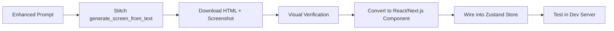

# EaseAI — Multi-Model AI Workspace

Build a multi-model AI workspace with graphical conversation branching, context-scoped messaging, and a dark precision aesthetic ("IDE meets research notebook").

## User Review Required

> [!IMPORTANT]
> **Stack Reconciliation:** Your vibe document specifies **Next.js 14 + Tailwind CSS + FastAPI (Python)**, but the description header mentions **Node.js + Fastify + PostgreSQL**. The plan below follows the **vibe document** (Next.js 14, Tailwind, FastAPI, Zustand) since it's the more detailed specification. Confirm this is correct.

> [!IMPORTANT]
> **Stitch MCP for UI Generation:** The plan uses Stitch to generate high-fidelity designs for each major screen (Landing, Workspace, Settings, Export), then converts those designs into React/Next.js components. This is a multi-phase process — Stitch generates HTML designs, which are then adapted into the Next.js component architecture.

> [!WARNING]
> **API Keys for Model Proxying:** The FastAPI backend will proxy requests to Claude, GPT-4o, and Gemini. For the hackathon, API keys are stored in `localStorage` and sent per-request. No server-side key storage in v1.

## Open Questions

> [!IMPORTANT]
> 1. **FastAPI Backend:** Should we scaffold the Python FastAPI backend as a separate directory (`/backend`) within this workspace, or do you have a separate repo for it?
> 2. **Hackathon Scope:** The vibe doc mentions "no auth for hackathon" — should the Landing page CTA go directly to `/workspace` without any login flow?
> 3. **Database:** The vibe doc says "in-memory tree store for hackathon" with Zustand. Should we skip PostgreSQL entirely for v1 and keep everything client-side?
> 4. **Deployment:** Any deployment target (Vercel, etc.) or purely local dev for now?

---

## Proposed Changes

The build is organized into **6 phases**, each producing working, testable output.

---

### Phase 1: Project Scaffolding & Design System

Set up the Next.js 14 project, Tailwind config with EaseAI's custom tokens, and create the Stitch design system.

#### [NEW] Next.js 14 Project

Scaffold with `npx create-next-app@latest ./` in the workspace root using:
- App Router
- TypeScript (strict)
- Tailwind CSS
- `src/` directory structure
- No ESLint (speed for hackathon)

#### [NEW] [tailwind.config.ts](file:///c:/Users/sansk/OneDrive/Desktop/Portfolio-website/tailwind.config.ts)

Custom color tokens from the vibe doc:

| Token | Hex | Usage |
|-------|-----|-------|
| `canvas` | `#0D0D0D` | Page background |
| `surface` | `#141414` | Primary surface |
| `raised` | `#1C1C1C` | Elevated elements |
| `card` | `#252525` | Cards, panels |
| `iris` | `#534AB7` | Interactive/selected |
| `teal` | `#0F6E56` | Success/resolved |
| `amber` | `#854F0B` | Warning/pending |
| `offwhite` | `#EDEDED` | Primary text |

Font families: Inter (sans), Georgia (serif), JetBrains Mono (mono).

#### [NEW] [src/app/globals.css](file:///c:/Users/sansk/OneDrive/Desktop/Portfolio-website/src/app/globals.css)

- Dark mode as default (`class="dark"` on root)
- `.ai-response` class: Georgia serif, 15px, line-height 1.75
- Custom scrollbar styling for dark theme
- Typography scale from vibe doc

#### [NEW] [.stitch/DESIGN.md](file:///c:/Users/sansk/OneDrive/Desktop/Portfolio-website/.stitch/DESIGN.md)

Create EaseAI design system file following the `design-md` and `taste-design` skills:
- Visual Theme: "Dark Precision" — dense, restrained, IDE-meets-notebook
- Color palette with functional roles
- Typography rules (serif for AI, sans for UI)
- Component stylings (no avatars, no skeletons, blinking cursor)
- Layout principles (fixed 240px branch panel, 48px tab bar, 56px input bar)

#### [NEW] Stitch Project & Design System Upload

1. Create Stitch project via MCP (`create_project`)
2. Upload DESIGN.md to Stitch
3. Create design system from DESIGN.md (`create_design_system_from_design_md`)
4. Save project metadata to `.stitch/metadata.json`

---

### Phase 2: Shared Types & State Management

#### [NEW] [src/types/index.ts](file:///c:/Users/sansk/OneDrive/Desktop/Portfolio-website/src/types/index.ts)

Shared TypeScript interfaces:

```typescript
interface Tab {
  id: string;
  model: 'claude' | 'gpt4o' | 'gemini';
  name: string;
  color: string;          // Model dot color
  rootNodeId: string;
  activeNodeId: string;
}

interface ConversationNode {
  id: string;
  parentId: string | null;
  children: string[];
  messages: Message[];
  scope: 'full' | 'branch';     // Context scope
  anchorText?: string;           // Text selection that spawned this branch
  anchorMessageId?: string;      // Message the branch is anchored to
  collapsed: boolean;
}

interface Message {
  id: string;
  role: 'user' | 'assistant';
  content: string;
  model?: string;
  timestamp: number;
  annotations: Annotation[];
  isStreaming: boolean;
}

interface Annotation {
  id: string;
  text: string;
  injected: boolean;  // Whether to inject as context
  range?: { start: number; end: number };
}
```

#### [NEW] [src/store/tabStore.ts](file:///c:/Users/sansk/OneDrive/Desktop/Portfolio-website/src/store/tabStore.ts)

Zustand store for tab state:
- `tabs: Tab[]` — active model sessions
- `activeTabId: string`
- Actions: `addTab`, `removeTab`, `setActiveTab`, `setModel`

#### [NEW] [src/store/nodeStore.ts](file:///c:/Users/sansk/OneDrive/Desktop/Portfolio-website/src/store/nodeStore.ts)

Zustand store for conversation tree:
- `nodes: Record<string, ConversationNode>` — adjacency list
- Actions: `addNode`, `addMessage`, `updateMessage` (streaming), `setScope`, `branchFromSelection`, `toggleCollapse`
- **Context assembly logic:** `getContextForNode(nodeId, scope)` — walks the ancestor chain (full) or returns only the anchored message (branch)

#### [NEW] [src/lib/api.ts](file:///c:/Users/sansk/OneDrive/Desktop/Portfolio-website/src/lib/api.ts)

SSE streaming client:
- `streamChat(messages: Message[], model: string, apiKey: string)` — returns an async iterator
- Handles SSE connection lifecycle
- Supports abort via `AbortController`

---

### Phase 3: Stitch UI Generation — Landing Page

Use the Stitch Loop + Generate Design skills to create the Landing page.

#### Stitch Generation: Landing Page

**Enhanced Prompt:**
> A dark, precision-focused landing page for EaseAI, a multi-model AI workspace. The page communicates "IDE meets research notebook" — restrained, dense, purposeful.
>
> **PLATFORM:** Web, Desktop-first
>
> **PAGE STRUCTURE:**
> 1. **Header:** Minimal navigation bar with "EaseAI" wordmark on the left (clean sans-serif, tracking-tight), and a single "Open Workspace" ghost button on the right
> 2. **Hero Section:** Left-aligned headline on dark canvas background: "Multi-model conversations with context that matters." Subtext explaining context-scoped branching. Single primary CTA button "Open Workspace" in iris purple
> 3. **Feature Grid:** Three feature cards on near-black surface — (a) "Context Assembly" with branching tree icon, (b) "Multi-Model Tabs" with tab icon showing Claude/GPT-4o/Gemini, (c) "Semantic Diff" with split-view comparison icon. Cards use raised surface color with subtle 1px borders
> 4. **Demo Section:** A full-width embedded video placeholder or static screenshot showing the workspace with branch panel visible
> 5. **Footer:** Minimal — "Built for hackathon" text, links

#### [NEW] [src/app/page.tsx](file:///c:/Users/sansk/OneDrive/Desktop/Portfolio-website/src/app/page.tsx)

Convert Stitch-generated landing page HTML into Next.js server component. Static page, no client interactivity needed. Links to `/workspace`.

---

### Phase 4: Stitch UI Generation — Core Workspace Components

This is the main development phase. Each component gets a Stitch design, then React implementation.

#### Stitch Generation: Tab Bar

**Prompt:** A compact 48px browser-like tab bar on dark surface. Each tab shows a colored model dot (purple for Claude, teal for GPT-4o, amber for Gemini) followed by the model name. Active tab has subtle iris purple bottom border. Close button (×) on hover. A [+] button at the end opens a model dropdown. Settings gear icon on the far right.

#### [NEW] [src/components/TabBar.tsx](file:///c:/Users/sansk/OneDrive/Desktop/Portfolio-website/src/components/TabBar.tsx)

Client component. Renders model tabs from `tabStore`. Tab click switches active session. [+] button opens model selector dropdown. × closes tab. Color-coded model dots.

---

#### Stitch Generation: Chat Window

**Prompt:** A dark canvas chat window with clean message bubbles. User messages: right-aligned, card-colored background, sans-serif Inter 14px. AI messages: left-aligned, no background, serif Georgia 15px with 1.75 line-height. Above each AI message, an 11px uppercase label in muted gray showing the model name. No avatars, no bot icons. Messages have generous vertical spacing. A blinking cursor appears at the bottom of the last AI message when streaming.

#### [NEW] [src/components/ChatWindow.tsx](file:///c:/Users/sansk/OneDrive/Desktop/Portfolio-website/src/components/ChatWindow.tsx)

Client component. Scrollable message list. Consumes streaming updates from `nodeStore`. Auto-scrolls on new content. Renders `MessageBubble` for each message.

#### [NEW] [src/components/MessageBubble.tsx](file:///c:/Users/sansk/OneDrive/Desktop/Portfolio-website/src/components/MessageBubble.tsx)

- Renders user or AI message with correct typography
- Text selection handler → shows "Ask here" tooltip for branching
- Inline annotation markers (amber dots)
- Streaming cursor (blinking `|`) for active responses
- Model label above AI responses

---

#### Stitch Generation: Branch Panel

**Prompt:** A fixed 240px right panel on dark raised surface. Shows the conversation tree as a vertical node list. Each node is a compact row: indentation shows depth, a small colored dot indicates the model, truncated first message as label. Active node highlighted with iris purple left border. Collapse/expand arrows for nodes with children. Clean, minimal — like a file tree in VS Code.

#### [NEW] [src/components/BranchPanel.tsx](file:///c:/Users/sansk/OneDrive/Desktop/Portfolio-website/src/components/BranchPanel.tsx)

Fixed 240px right panel. Recursive tree rendering of `nodeStore`. Click to navigate to node. Collapse/expand controls. Active node highlighted.

---

#### Stitch Generation: Input Bar

**Prompt:** A 56px input bar at the bottom on dark surface. Left side: a small dropdown toggle showing "Context: Full ▾" or "Context: Branch ▾" — this is the scope selector. Center: a text input with off-white text on surface background, placeholder "Type your message...". Right side: a send button (arrow icon) in iris purple. The scope dropdown opens upward showing two options: "Full chain" and "Branch only" with brief descriptions.

#### [NEW] [src/components/InputBar.tsx](file:///c:/Users/sansk/OneDrive/Desktop/Portfolio-website/src/components/InputBar.tsx)

- Text input with keyboard submit (Enter)
- Context scope toggle dropdown (full/branch)
- Send button
- On send: calls `nodeStore.addMessage()`, then triggers SSE stream via `api.ts`
- Streams response token-by-token into `nodeStore.updateMessage()`

---

#### Stitch Generation: Annotation Marker

**Prompt:** A small annotation component on dark surface. An amber dot marker in the margin of an AI message. Clicking it expands a small inline comment box with the annotation text. A small "Inject" toggle button — when active, the annotation is highlighted amber and will be included as structured context in the next prompt.

#### [NEW] [src/components/AnnotationMarker.tsx](file:///c:/Users/sansk/OneDrive/Desktop/Portfolio-website/src/components/AnnotationMarker.tsx)

- Inline annotation on AI messages
- Click to expand/collapse comment
- "Inject" toggle to mark as context for next send
- Amber color encoding when injected

---

#### [NEW] [src/app/workspace/page.tsx](file:///c:/Users/sansk/OneDrive/Desktop/Portfolio-website/src/app/workspace/page.tsx)

Main workspace page (client component). Composes:
- `TabBar` (top, 48px)
- `ChatWindow` (center, fills remaining space)
- `BranchPanel` (right, 240px fixed)
- `InputBar` (bottom, 56px)

CSS Grid layout matching the vibe doc wireframe.

---

### Phase 5: Settings & Export Pages

#### Stitch Generation: Settings Page

**Prompt:** A minimal dark settings page. Centered card on canvas background. Three API key input fields stacked vertically: Claude (purple dot), GPT-4o (teal dot), Gemini (amber dot). Each has a labeled text input with a show/hide toggle. A "Save" button at the bottom. All stored locally — a small note says "Keys are stored in your browser only."

#### [NEW] [src/app/settings/page.tsx](file:///c:/Users/sansk/OneDrive/Desktop/Portfolio-website/src/app/settings/page.tsx)

API key management. `localStorage` read/write. Three provider inputs with model-colored dots.

---

#### Stitch Generation: Export Page

**Prompt:** A dark export view showing a conversation tree rendered as structured text. A toggle at the top switches between Markdown and JSON preview. The main area shows formatted output: main thread messages as body text, branches indented or shown as footnotes. A "Download" button in iris purple at the top right.

#### [NEW] [src/app/export/page.tsx](file:///c:/Users/sansk/OneDrive/Desktop/Portfolio-website/src/app/export/page.tsx)

Tree export view. Reads `nodeStore`, formats as Markdown (main thread + branch footnotes) or JSON. Download button triggers file save.

---

### Phase 6: FastAPI Backend (Streaming Proxy)

#### [NEW] [backend/main.py](file:///c:/Users/sansk/OneDrive/Desktop/Portfolio-website/backend/main.py)

FastAPI application:
- **POST `/api/chat/stream`** — SSE streaming endpoint
  - Accepts: `{ messages: Message[], model: string, apiKey: string }`
  - Routes to appropriate provider API (Anthropic, OpenAI, Google)
  - Streams response tokens via SSE
- **Context assembler** is client-side (Zustand) for hackathon — the backend just proxies the assembled message array

#### [NEW] [backend/providers/](file:///c:/Users/sansk/OneDrive/Desktop/Portfolio-website/backend/providers/)

Provider-specific adapters:
- `claude.py` — Anthropic Messages API
- `openai.py` — OpenAI Chat Completions API
- `gemini.py` — Google Generative AI API (Vertex AI)

#### [NEW] [backend/requirements.txt](file:///c:/Users/sansk/OneDrive/Desktop/Portfolio-website/backend/requirements.txt)

```
fastapi
uvicorn
sse-starlette
anthropic
openai
google-generativeai
httpx
```

---

## Execution Strategy with Stitch

For each UI component, we follow this pipeline:



1. **Create Stitch project** with EaseAI design system (Phase 1)
2. **Generate each screen** using enhanced prompts from the vibe doc
3. **Download and verify** designs locally
4. **Convert to React components** following the `react:components` skill
5. **Integrate** with Zustand stores and SSE streaming

---

## Verification Plan

### Automated Tests
- `npm run build` — TypeScript compilation check
- `npm run dev` — Dev server starts without errors

### Manual Verification
- Visual fidelity: Compare Stitch screenshots with rendered Next.js components
- Typography: Confirm serif (Georgia) for AI responses, sans (Inter) for UI
- Color coding: Verify purple/teal/amber semantic usage
- Layout: 240px fixed branch panel, 48px tab bar, 56px input bar
- Context scoping: Branch with "full" vs "branch" context produces different message arrays
- Streaming: SSE tokens render progressively with blinking cursor
- Tree navigation: Click nodes in branch panel to switch context
- Export: Download conversation tree as Markdown and JSON

### Browser Verification
- Use browser subagent to visually verify each page after integration
- Check responsive behavior (though dark desktop-first is the priority)
